# SET09623 2022-3 TR2 001 - DEVOPS (Group 5)
# Team roles

| Role          | Member Name      | Matric No |
|---------------|------------------|-----------|
| Scrum Master  | Htoo Myat Htun   | 40516588  |
| Product Owner | Thuta Ko Ko      | 40524286  |
| Team Member   | Htun Aung Hlaing | 40516567  |

## Contribution Spreadsheet of the team
| Name             | Code Review 1 | Code Review 2 | Code Review 3 | Code Review 4 | Final Deliverable |
|------------------|---------------|---------------|---------------|---------------|-------------------|
| Htoo Myat Tun   | 33.34         | 33.33         | 33.33         | 33.33         | 33.33             |    
| Thuta Ko Ko      | 33.33         | 33.33         | 33.34         | 33.33         | 33.33             |    
| Htun Aung Hlaing | 33.33         | 33.34         | 33.33         | 33.34         | 33.34             |     

- Workflow      :

- License       :

- Release       : 

- Master Build  :

- Develop Build :

- Codecoverage  :

## Link the Project from Zube
https://zube.io/group5-3/gp5/w/workspace-1/kanban

# 32 requirements of 32 have been implemented, which is 100%.
| ID  | Name                                                                                                  | Met | Screenshot                |
|-----|-------------------------------------------------------------------------------------------------------|-----|---------------------------|
| 1   | All the countries in the world organised by largest population to smallest.                           | Yes | 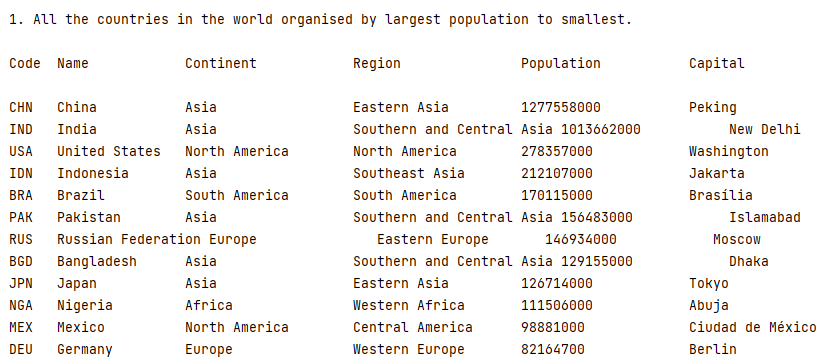  |
| 2   | All the countries in a continent organised by largest population to smallest.                         | Yes | 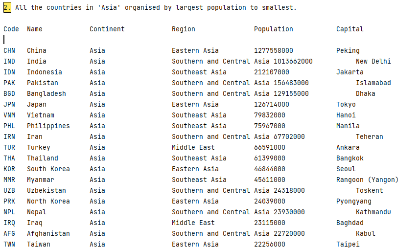  |
| 3   | All the countries in a region organised by largest population to smallest.                            | Yes | 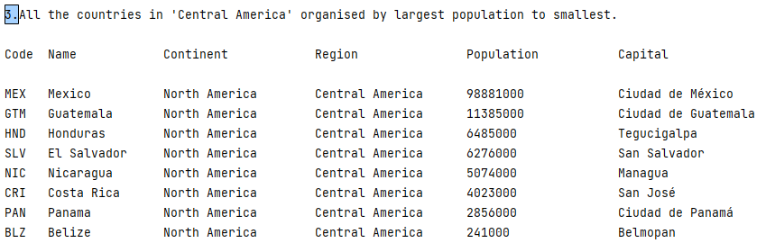  |
| 4   | The top N populated countries in the world where N is provided by the user.                           | Yes | 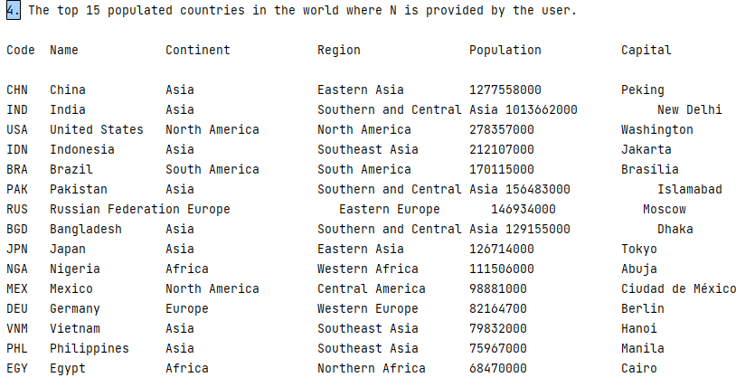  |
| 5   | The top N populated countries in a continent where N is provided by the user.                         | Yes | 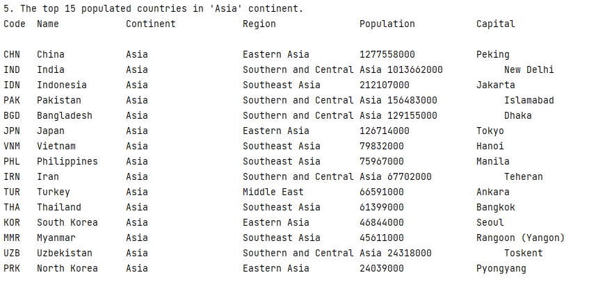  |
| 6   | The top N populated countries in a region where N is provided by the user.                            | Yes | 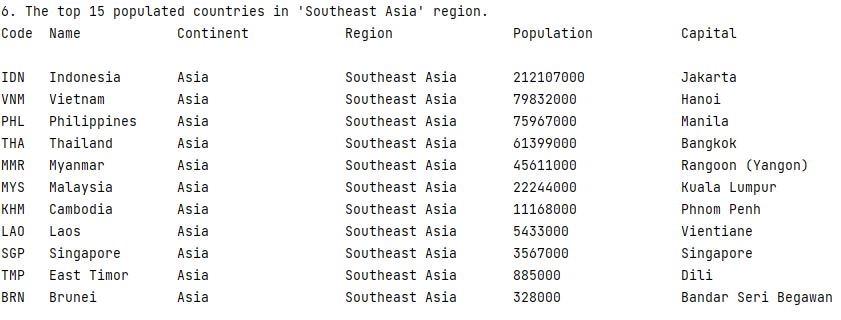  |
| 7   | All the cities in the world organised by largest population to smallest.                              | Yes | 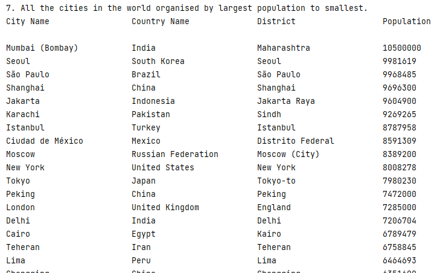  |
| 8   | All the cities in a continent organised by largest population to smallest.                            | Yes | 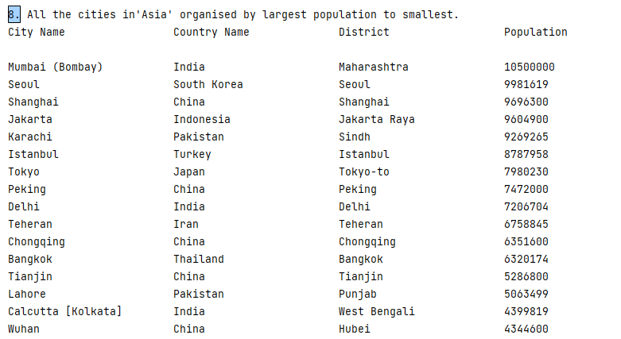  |
| 9   | All the cities in a region organised by largest population to smallest.                               | Yes | 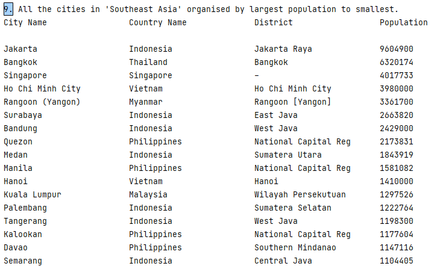  |
| 10  | All the cities in a country organised by largest population to smallest.                              | Yes | 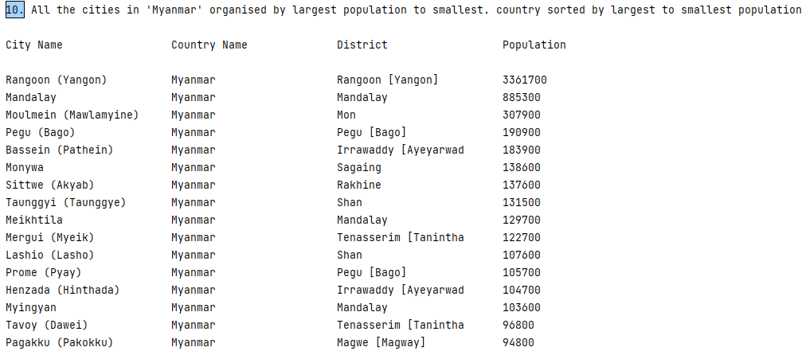 |
| 11  | All the cities in a district organised by largest population to smallest.                             | Yes | 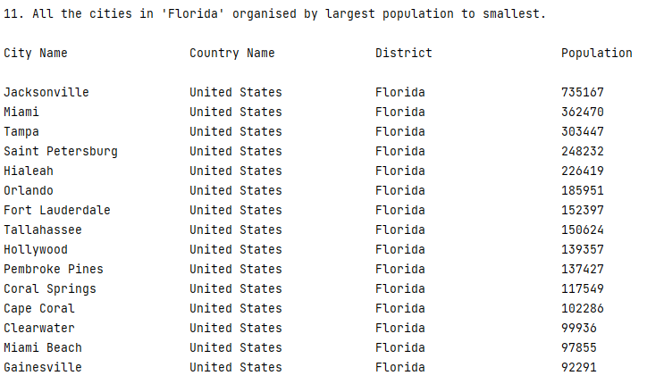 |
| 12  | The top N populated cities in the world where N is provided by the user.                              | Yes | 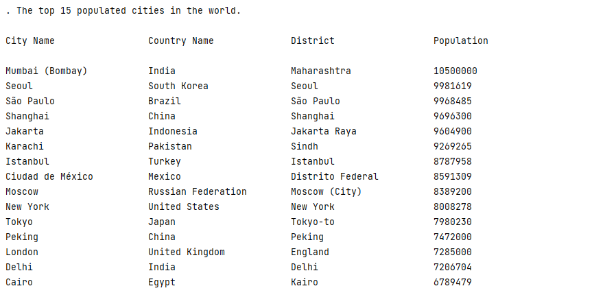 |
| 13  | The top N populated cities in a continent where N is provided by the user.                            | Yes | 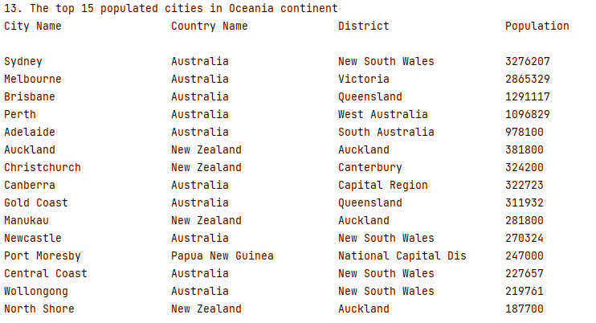 |
| 14  | The top N populated cities in a region where N is provided by the user.                               | Yes | 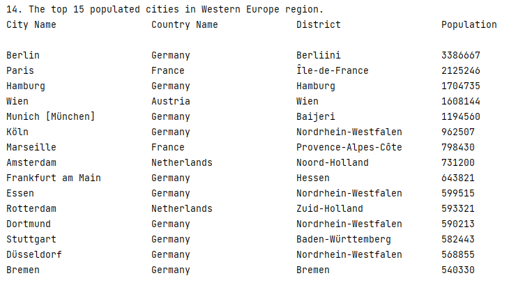 |
| 15  | The top N populated cities in a country where N is provided by the user.                              | Yes | 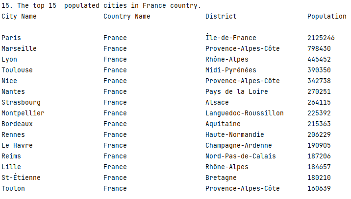 |
| 16  | The top N populated cities in a district where N is provided by the user.                             | Yes | 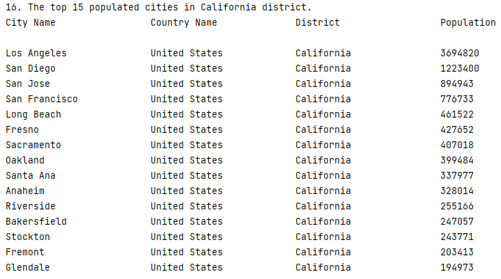 |
| 17  | All the capital cities in the world organised by largest population to smallest.                      | Yes | 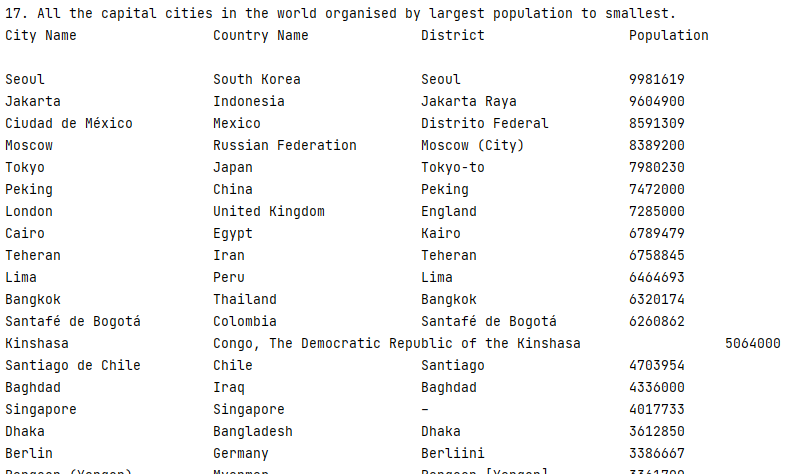 |
| 18  | All the capital cities in a continent organised by largest population to smallest.                    | Yes | 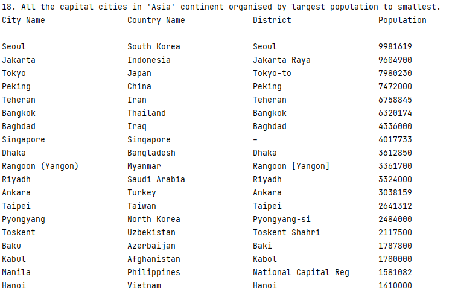 |
| 19  | All the capital cities in a region organised by largest to smallest.                                  | Yes | 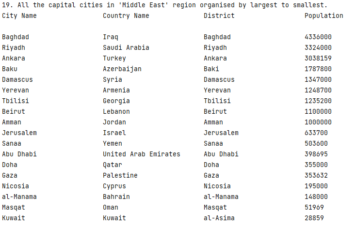 |
| 20  | The top N populated capital cities in the world where N is provided by the user.                      | Yes | 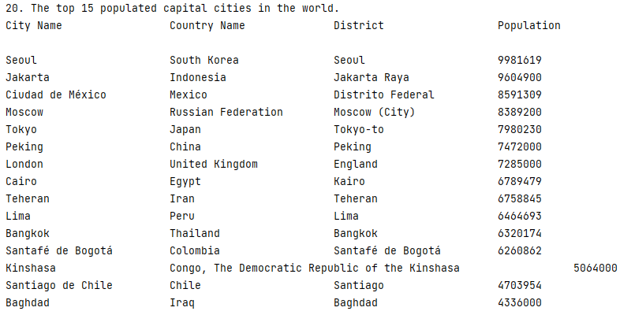 |
| 21  | The top N populated capital cities in a continent where N is provided by the user.                    | Yes | 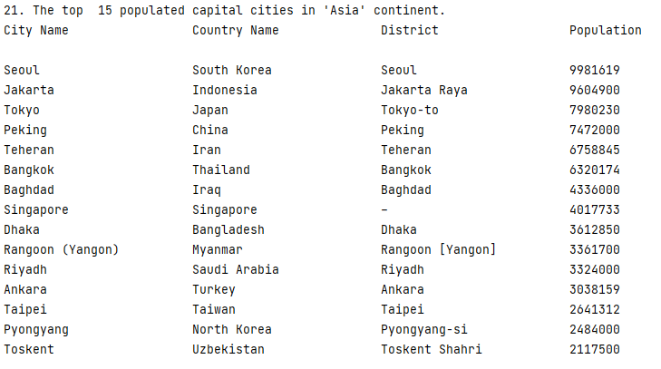 |
| 22  | The top N populated capital cities in a region where N is provided by the user.                       | Yes | 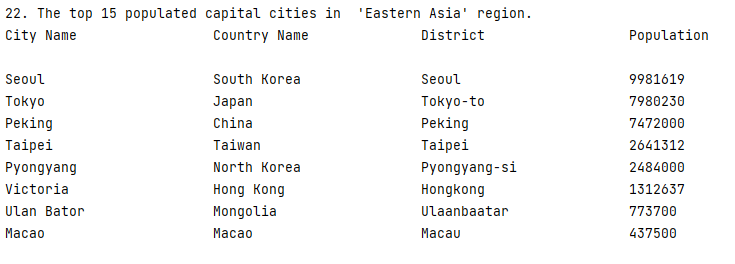 |
| 23  | The population of people, people living in cities, and people not living in cities in each continent. | Yes | 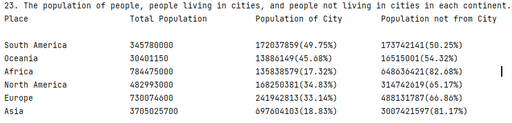 |
| 24  | The population of people, people living in cities, and people not living in cities in each region.    | Yes | 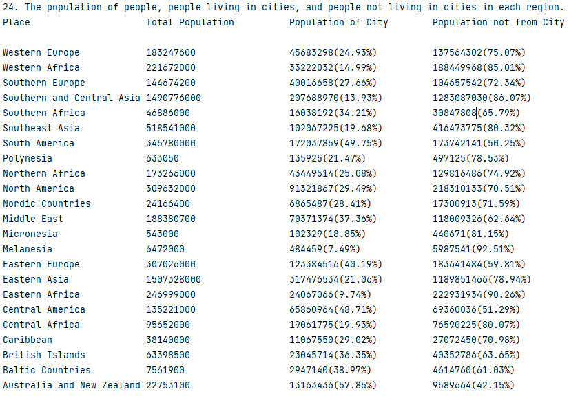 |
| 25  | The population of people, people living in cities, and people not living in cities in each country.   | Yes |  |
| 26  | The population of the world.                                                                          | Yes | 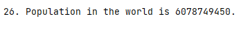 |
| 27  | The population of a continent.                                                                        | Yes | 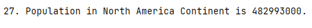 |
| 28  | The population of a region.                                                                           | Yes | 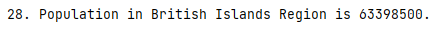 |
| 29  | The population of a country.                                                                          | Yes | 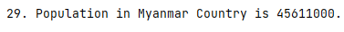 |
| 30  | The population of a district.                                                                         | Yes | 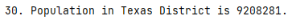 |
| 31  | The population of a city.                                                                             | Yes | 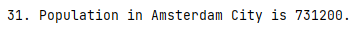 |
| 32  | Languages from the greatest number to smallest, including the percentage of the world population      | Yes | 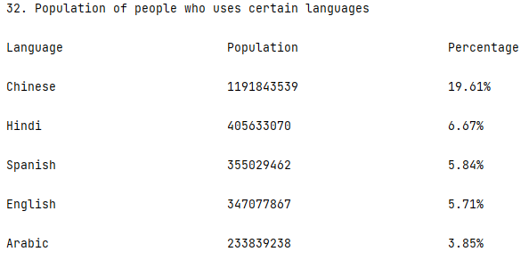 |

